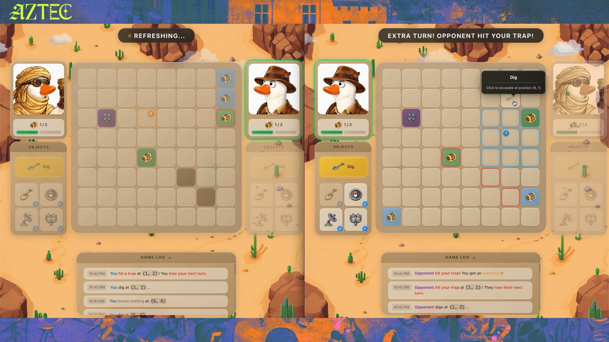
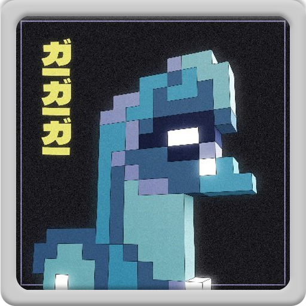

<h1 align="center">Aztec – Treasure Hunt</h1>

<p align="center">
  
</p>

**Treasure Hunt** is a two-player strategy game built on the **Aztec network**.
The goal is simple: **find your opponent's hidden treasures before they find yours**.

## Demo Video

Aztec supports **private state** and **private actions**, which enables game mechanics that are not possible in traditional on-chain games.

Your opponent just did something.  
You don’t know what.

Did they move a treasure?  
Did they place a trap where you’re about to dig?

There is no way to know. You only know that *something* changed.

That kind of genuine uncertainty does not exist in other on-chain games.

---

## The problem with privacy in blockchain games

Most blockchain games that want privacy end up with one of these two approaches — and both have major downsides:

### 1) Everything is public
Imagine playing Battleship while your opponent can see exactly where your ships are.  
There is no strategy, no bluffing, no mind games.

### 2) Commit–reveal
You publish a hash of your state at the start of the game.

This works for fixed setups, but it has a fundamental limitation: **your strategy becomes frozen**.

You cannot:
- Move pieces secretly
- Add hidden elements during the match
- Adapt your strategy mid-game

If you re-commit, you leak that something changed (and often *what* changed).

So if you want a game where players can adapt privately during the match, commit–reveal doesn’t work.

---

## Treasure Hunt: a game with real privacy

Treasure Hunt is a two-player game:

- Each player hides **3 treasures** on an **8×8** board
- Players take turns digging on the opponent’s board
- The first player to find **2 treasures** wins

At first glance, it sounds like Battleship. The difference is **powers**:

| Power | What it does |
|------|--------------|
| **Radar** | Scans a 3×3 area and reveals how many treasures are inside (not their positions) |
| **Compass** | Reveals the distance to the closest treasure |
| **Golden Shovel** | Moves one of your treasures to another tile |
| **Trap** | If the opponent digs there, they lose their next turn |

### Public vs private actions

- **Radar** and **Compass** are **public**: when you use them, your opponent knows.
- **Golden Shovel** and **Trap** are **private**: your opponent only sees that you “used an invisible action”.

From the outside, **moving a treasure** and **placing a trap look exactly the same**.

---

## A single turn can change everything

Imagine this situation:

```text
Your treasure is at (5,5).
Your opponent uses Compass → "Distance: 3"
They are getting close.

You use Golden Shovel → move the treasure to (1,1)
Your opponent only sees: "invisible action used"

Next turn, they dig at (5,5) → Empty.
````

Did they miscalculate the distance?
Or did you move the treasure?

They cannot know.

Each private action adds real uncertainty:

* Is the treasure still there?
* Was a trap placed?
* Did nothing happen at all?

The information is truly private, not just hidden temporarily.

---

## Why commit–reveal cannot do this

With commit–reveal, you publish something like:

```text
hash(initial_positions + salt)
```

That locks your state in place.

| What you want to do                      | Commit–reveal                            | Aztec                          |
| ---------------------------------------- | ---------------------------------------- | ------------------------------ |
| Move treasures mid-game                  | Requires re-commit (reveals a change)    | Fully invisible                |
| Place traps during the match             | Not possible (not in the initial commit) | Works naturally                |
| Make different actions indistinguishable | Different actions leak different signals | Shovel and Trap look identical |

---

## Selective privacy

Not everything in Treasure Hunt is private.
The game intentionally mixes **public and private information**:

```text
PUBLIC                               PRIVATE
─────────────────────────────────    ─────────────────────────────────
• Whose turn it is                   • Treasure positions
• Dig results                        • Trap positions
• When Radar or Compass is used      • Was it Shovel or Trap?
```

This creates interesting gameplay:

* Radar and Compass are **deducible** (their usage is public and limited)
* Golden Shovel and Trap remain **ambiguous until the end**

---

## Try it yourself

### Prerequisites

```bash
# Docker installed

# Install Aztec CLI
bash -i <(curl -s https://install.aztec.network)

# Install the devnet version
aztec-up 3.0.0-devnet.20251212
```

### Run the game

```bash
# Terminal 1: Start the local network
aztec start --local-network

# Terminal 2: Contracts
cd contracts && yarn install
yarn compile && yarn codegen && yarn deploy

# Terminal 3: Client
cd client && yarn install
yarn dev
# Open http://localhost:3001
```

---

## Creators ✨

<table>
  <tbody>
    <tr>
            <td align="center" valign="top" width="33%"><a href="https://caravana.studio"><br /><sub><b>Caravana Studio</b></sub></a></td>
      <td align="center" valign="top" width="33%"><a href="https://x.com/dub_zn"><br /><sub><b>@dub_zn</b></sub></a></td>
      <td align="center" valign="top" width="33%"><a href="https://x.com/dpinoness"><br /><sub><b>@dpinoness</b></sub></a></td>
    </tr>
  </tbody>
</table>
