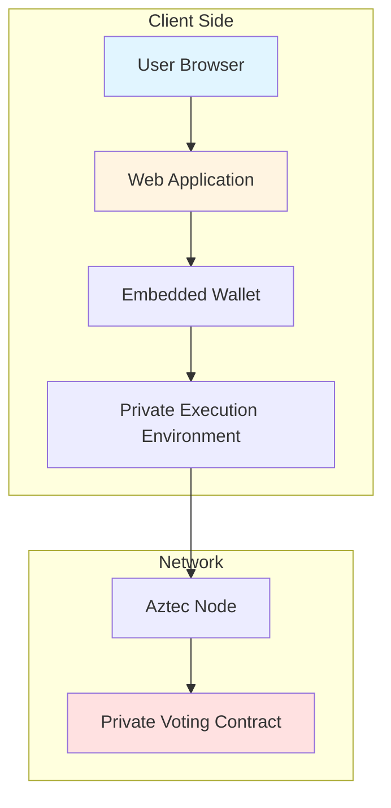
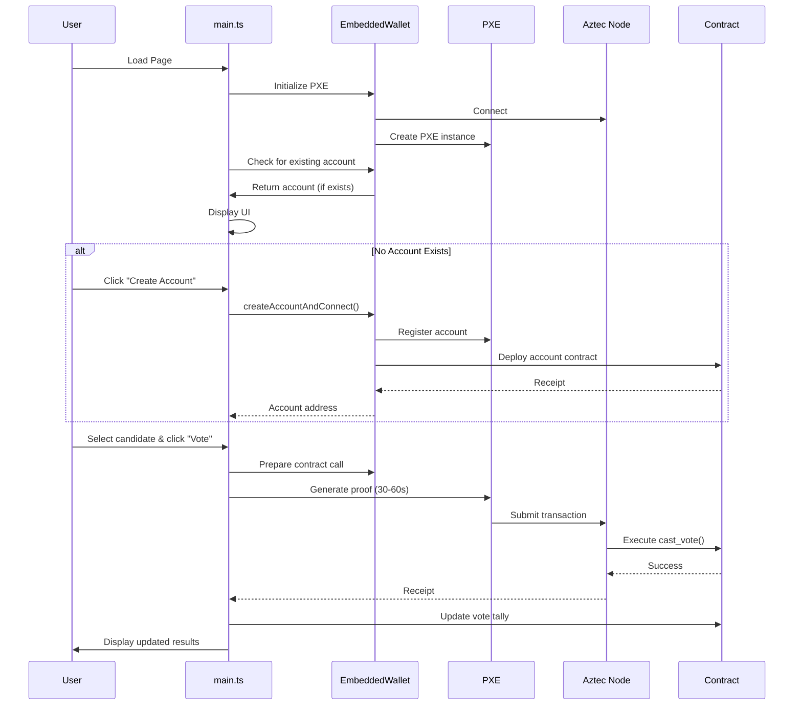
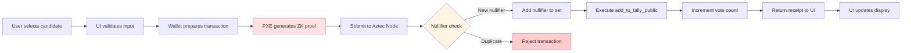
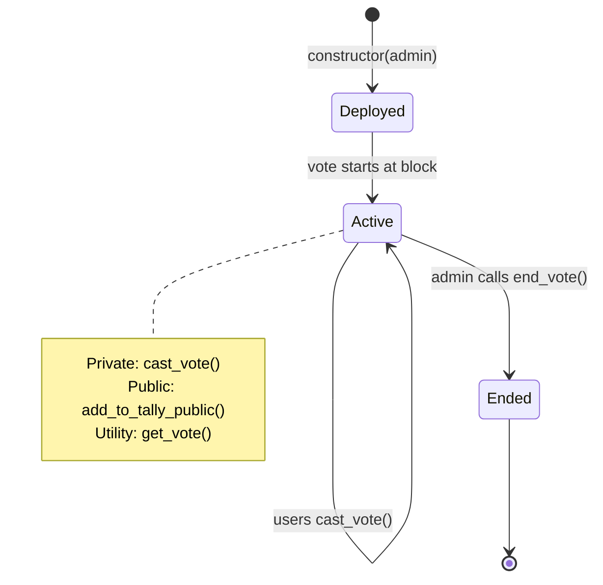

# Aztec Private Voting Application - Technical Guide

## Table of Contents

1. [Overview](#overview)
2. [Architecture](#architecture)
3. [Key Concepts](#key-concepts)
4. [Component Breakdown](#component-breakdown)
5. [Data Flow](#data-flow)
6. [Smart Contract](#smart-contract)
7. [Security & Privacy](#security--privacy)
8. [Deployment Process](#deployment-process)
9. [Common Pitfalls](#common-pitfalls)
10. [Learning Path](#learning-path)

---

## Overview

This is a **private voting web application** built on the Aztec Network, demonstrating zero-knowledge proof technology for anonymous voting. The application allows users to cast votes for one of five candidates while maintaining complete privacy about who voted and what they voted for.

### What Makes This Special?

Unlike traditional blockchain voting systems where all votes are public:

- **Vote choices remain private** - No one can see which candidate you voted for
- **Voter identity is protected** - Your identity is cryptographically concealed
- **Double-voting is prevented** - The system prevents voting twice without revealing voter identity
- **Results are transparent** - Vote tallies are publicly visible

### Difficulty Level

**Intermediate to Advanced** - Requires understanding of:

- Blockchain/distributed ledger concepts
- Zero-knowledge proofs (basic understanding)
- TypeScript/JavaScript
- Asynchronous programming
- Smart contracts

---

## Architecture

### High-Level System Diagram



### Technology Stack

| Layer              | Technology                          | Purpose                                  |
| ------------------ | ----------------------------------- | ---------------------------------------- |
| **Frontend**       | HTML + TypeScript + Webpack         | User interface                           |
| **Wallet**         | Custom Embedded Wallet              | Account management & transaction signing |
| **Execution**      | PXE (Private Execution Environment) | Client-side proof generation             |
| **Network**        | Aztec Node                          | Blockchain network interaction           |
| **Smart Contract** | Noir (Aztec's language)             | Vote logic & storage                     |
| **Testing**        | Playwright                          | End-to-end tests                         |

---

## Key Concepts

### 1. Private Execution Environment (PXE)

The PXE is a **client-side component** that:

- Generates zero-knowledge proofs locally in your browser
- Manages encrypted state
- Interacts with the Aztec Node

**Why it matters**: Proofs are generated on YOUR machine, meaning the network never sees your raw vote data.

### 2. Nullifiers

A **nullifier** is a unique cryptographic value that:

- Is derived from your address + secret key
- Prevents double-voting
- Doesn't reveal your identity

**Simple Analogy**: Think of it like a tamper-proof ballot box slot - once you put your ballot through your unique slot, that slot becomes permanently marked as "used," but no one can tell who owns which slot.

```typescript
// From contracts/src/main.nr:48
let nullifier = poseidon2_hash([
  self.msg_sender().unwrap().to_field(),
  secret,
]);
self.context.push_nullifier(nullifier);
```

### 3. Sponsored Fee Payment

Instead of users paying transaction fees, this application uses **Sponsored FPC** (Fee Payment Contract):

- A special contract pays fees on behalf of users
- Users don't need native tokens to interact
- Perfect for demos and onboarding

**In Production**: You'd typically use a different fee payment mechanism.

### 4. Zero-Knowledge Proofs

When you vote, the application:

1. Generates a proof that says "I have a valid vote, and I haven't voted before"
2. Sends the proof to the network
3. The network verifies the proof WITHOUT seeing your vote details

**Time Warning**: Proof generation can take 30-60 seconds on first run (needs to download ~67MB proving key).

---

## Component Breakdown

### 1. Smart Contract (`contracts/src/main.nr`)

The Noir smart contract is the heart of the voting logic.

#### Storage Structure

```noir
struct Storage<Context> {
    admin: PublicMutable<AztecAddress, Context>,           // Who can end the vote
    tally: Map<Field, PublicMutable<Field, Context>>,      // candidate → vote count
    vote_ended: PublicMutable<bool, Context>,              // Is voting closed?
    active_at_block: PublicImmutable<u32, Context>,        // When voting started
}
```

#### Key Functions

**Constructor** - Initializes the contract

```noir
fn constructor(admin: AztecAddress) {
    self.storage.admin.write(admin);
    self.storage.vote_ended.write(false);
    self.storage.active_at_block.initialize(self.context.block_number());
}
```

**cast_vote** - Private function to cast a vote

```noir
#[external("private")]
fn cast_vote(candidate: Field) {
    // Step 1: Get nullifier public key
    let msg_sender_nullifier_public_key_message_hash =
        get_public_keys(self.msg_sender().unwrap()).npk_m.hash();

    // Step 2: Get secret key (only you can do this)
    let secret = self.context.request_nsk_app(msg_sender_nullifier_public_key_message_hash);

    // Step 3: Create nullifier (prevents double voting)
    let nullifier = poseidon2_hash([self.msg_sender().unwrap().to_field(), secret]);
    self.context.push_nullifier(nullifier);

    // Step 4: Add vote to public tally (using enqueue_self for same-contract calls)
    self.enqueue_self.add_to_tally_public(candidate);
}
```

**How it prevents double voting**:

1. Your nullifier is mathematically tied to your account
2. Once your nullifier is published, you can't publish it again
3. But no one can tell which nullifier belongs to which account!

**add_to_tally_public** - Public function to increment vote count

```noir
#[only_self]
#[external("public")]
fn add_to_tally_public(candidate: Field) {
    assert(self.storage.vote_ended.read() == false, "Vote has ended");
    let new_tally = self.storage.tally.at(candidate).read() + 1;
    self.storage.tally.at(candidate).write(new_tally);
}
```

**get_vote** - Read vote tally (unconstrained = free to call)

```noir
#[external("utility")]
unconstrained fn get_vote(candidate: Field) -> pub Field {
    self.storage.tally.at(candidate).read()
}
```

### 2. Embedded Wallet (`app/embedded-wallet.ts`)

A custom wallet implementation that manages accounts and transactions.

#### Wallet Initialization

```typescript
static async initialize(nodeUrl: string) {
    // 1. Connect to Aztec Node
    const aztecNode = createAztecNodeClient(nodeUrl);

    // 2. Configure PXE (Private Execution Environment)
    const config = getPXEConfig();
    config.l1Contracts = await aztecNode.getL1ContractAddresses();
    config.proverEnabled = PROVER_ENABLED;

    // 3. Create PXE instance
    const pxe = await createPXE(aztecNode, config, {
        useLogSuffix: true,
    });

    // 4. Register Sponsored FPC Contract
    await pxe.registerContract(await EmbeddedWallet.#getSponsoredPFCContract());

    return new EmbeddedWallet(pxe, aztecNode);
}
```

#### Account Creation Flow

```typescript
async createAccountAndConnect() {
    // 1. Generate random cryptographic keys
    const salt = Fr.random();           // Randomness for address derivation
    const secretKey = Fr.random();      // Master secret
    const signingKey = randomBytes(32); // ECDSA signing key

    // 2. Create ECDSA account contract
    const contract = new EcdsaRAccountContract(signingKey);
    const accountManager = await AccountManager.create(
        this,
        secretKey,
        contract,
        salt
    );

    // 3. Register with PXE BEFORE deploying
    await this.registerAccount(accountManager);

    // 4. Deploy the account contract
    const deployMethod = await accountManager.getDeployMethod();
    const receipt = await deployMethod.send(deployOpts).wait({ timeout: 120 });

    // 5. Store keys in browser's local storage
    localStorage.setItem(LocalStorageKey, JSON.stringify({
        address: accountManager.address.toString(),
        signingKey: signingKey.toString('hex'),
        secretKey: secretKey.toString(),
        salt: salt.toString(),
    }));

    return accountManager.address;
}
```

**Security Warning**: This stores keys in **plain text** in `localStorage`. This is fine for demos but NEVER do this in production!

#### Fee Payment Method

```typescript
override async getDefaultFeeOptions(
    from: AztecAddress,
    userFeeOptions: UserFeeOptions | undefined
): Promise<FeeOptions> {
    // Use Sponsored FPC if no payment method specified
    if (!userFeeOptions?.embeddedPaymentMethodFeePayer) {
        const sponsoredFPCContract = await EmbeddedWallet.#getSponsoredPFCContract();
        walletFeePaymentMethod = new SponsoredFeePaymentMethod(
            sponsoredFPCContract.instance.address
        );
    }
    // ... configure gas settings
}
```

### 3. Main Application (`app/main.ts`)

The UI logic that ties everything together.

#### Application Lifecycle



#### Page Load Initialization

```typescript
document.addEventListener('DOMContentLoaded', async () => {
  // 1. Validate environment variables
  if (!contractAddress) {
    throw new Error('Missing required environment variables');
  }

  // 2. Initialize wallet and connect to node
  wallet = await EmbeddedWallet.initialize(nodeUrl);

  // 3. Register the voting contract
  const instance = await getContractInstanceFromInstantiationParams(
    PrivateVotingContract.artifact,
    {
      deployer: AztecAddress.fromString(deployerAddress),
      salt: Fr.fromString(deploymentSalt),
      constructorArgs: [AztecAddress.fromString(deployerAddress)],
    }
  );
  await wallet.registerContract(instance, PrivateVotingContract.artifact);

  // 4. Check for existing account
  const account = await wallet.connectExistingAccount();

  // 5. Load vote tally if account exists
  if (account) {
    await updateVoteTally(wallet, account);
  }
});
```

#### Casting a Vote

```typescript
voteButton.addEventListener('click', async (e) => {
  // 1. Validate input
  const candidate = Number(voteInput.value);
  if (isNaN(candidate) || candidate < 1 || candidate > 5) {
    displayError('Invalid candidate number');
    return;
  }

  // 2. Get connected account
  const connectedAccount = wallet.getConnectedAccount();
  if (!connectedAccount) {
    throw new Error('No account connected');
  }

  // 3. Prepare contract interaction (Contract.at is now synchronous)
  const votingContract = PrivateVotingContract.at(
    AztecAddress.fromString(contractAddress),
    wallet
  );

  // 4. Send transaction and wait for confirmation
  await votingContract.methods
    .cast_vote(candidate)
    .send({ from: connectedAccount })
    .wait();

  // 5. Update the displayed tally
  await updateVoteTally(wallet, connectedAccount);
});
```

#### Updating Vote Tally

```typescript
async function updateVoteTally(wallet: Wallet, from: AztecAddress) {
  const votingContract = PrivateVotingContract.at(
    AztecAddress.fromString(contractAddress),
    wallet
  );

  // Query all 5 candidates in parallel
  await Promise.all(
    Array.from({ length: 5 }, async (_, i) => {
      const value = await votingContract.methods
        .get_vote(i + 1)
        .simulate({ from }); // simulate = free read, no transaction
      results[i + 1] = value;
    })
  );

  displayTally(results);
}
```

### 4. Deployment Script (`scripts/deploy.ts`)

Automates the deployment of accounts and contracts.

```typescript
async function createAccountAndDeployContract() {
  // 1. Setup wallet with temporary PXE store
  const aztecNode = createAztecNodeClient(AZTEC_NODE_URL);
  const wallet = await setupWallet(aztecNode);

  // 2. Register SponsoredFPC contract
  await wallet.registerContract(
    await getSponsoredPFCContract(),
    SponsoredFPCContractArtifact
  );

  // 3. Create deployer account
  const accountAddress = await createAccount(wallet);

  // 4. Deploy voting contract
  const deploymentInfo = await deployContract(wallet, accountAddress);

  // 5. Save deployment info to .env file
  await writeEnvFile(deploymentInfo);

  // 6. Clean up temporary store
  fs.rmSync(PXE_STORE_DIR, { recursive: true, force: true });
}
```

**Why this matters**: The `.env` file stores critical deployment information that the web app needs to interact with the contract.

---

## Data Flow

### Voting Transaction Flow



### What Happens When You Vote

**Step-by-Step Execution**:

1. **Client Side (Private)**:

   ```typescript
   // Your browser generates a proof that says:
   // "I know a secret key for address X, and X hasn't voted before"
   // The proof does NOT reveal:
   // - Your address
   // - Which candidate you voted for
   // - Your secret key
   ```

2. **Transaction Submission**:

   ```typescript
   // The transaction includes:
   // - The ZK proof
   // - Your nullifier (cryptographically concealed identifier)
   // - The candidate number (encrypted in the private portion)
   ```

3. **Network Verification**:

   ```typescript
   // The network checks:
   // 1. Is the proof valid?
   // 2. Has this nullifier been used before?
   // 3. Is the vote still active?
   ```

4. **State Update**:
   ```typescript
   // If all checks pass:
   // 1. Store the nullifier (prevents double voting)
   // 2. Increment the vote count for the candidate
   // 3. Return success
   ```

### Privacy Guarantees

| What is Private                   | What is Public                                 |
| --------------------------------- | ---------------------------------------------- |
| Your vote choice                  | That a vote was cast                           |
| Your identity                     | The total vote count per candidate             |
| Your nullifier → identity mapping | Nullifiers themselves (random-looking numbers) |

---

## Smart Contract

### Contract Lifecycle



### Function Types Explained

**Private Functions** (`#[external("private")]`):

- Execute on the client side
- Generate proofs
- State is encrypted
- Example: `cast_vote()`

**Public Functions** (`#[external("public")]`):

- Execute on the network
- State is transparent
- Example: `add_to_tally_public()`

**Only-Self Functions** (`#[only_self]`):

- Can only be called from within the same contract
- Example: `add_to_tally_public()` can only be called by `cast_vote()` via `self.enqueue_self`

**Utility Functions** (`#[external("utility")]`):

- Unconstrained reads (free, no transaction needed)
- Example: `get_vote()`

### Why Split Private and Public?

The `cast_vote` function uses a clever pattern:

1. **Private part** (`cast_vote`):

   - Validates you haven't voted (creates nullifier)
   - Keeps your vote private
   - Enqueues a call to the public function

2. **Public part** (`add_to_tally_public`):
   - Updates the public vote count
   - Checks vote hasn't ended
   - Visible to everyone

**This separation** allows:

- Private voting (who voted for what)
- Public results (vote totals)
- No one can link a nullifier back to an address!

---

## Deployment Process

### Step-by-Step Deployment Guide

**Prerequisites**:

```bash
# Install Aztec tools (version 3.0.0-devnet.20251212)
aztec-up 3.0.0-devnet.20251212

# Install dependencies
yarn install
```

**Step 1: Compile Smart Contracts**

```bash
yarn build-contracts
```

What happens:

1. Aztec CLI (`aztec compile`) compiles `contracts/src/main.nr`
2. TypeScript bindings are generated (`aztec codegen`)
3. Artifacts copied to `app/artifacts/`

**Step 2: Deploy Contracts**

```bash
yarn deploy-contracts
```

Execution flow:

```typescript
// scripts/deploy.ts
1. setupWallet()          // Create temporary PXE
2. createAccount()        // Generate & deploy deployer account
3. deployContract()       // Deploy voting contract
4. writeEnvFile()         // Save deployment info
```

Generated `.env` file:

```env
CONTRACT_ADDRESS=0x1234...  # Where the voting contract lives
DEPLOYER_ADDRESS=0x5678...  # Who deployed it (becomes admin)
DEPLOYMENT_SALT=0xabcd...   # Salt used for deterministic address
AZTEC_NODE_URL=http://localhost:8080
```

**Step 3: Run the Application**

```bash
yarn dev
```

Webpack serves the application at `http://localhost:3000`

**Step 4: Test**

```bash
yarn test
```

Playwright runs end-to-end tests:

1. Connects to Aztec Node
2. Creates test accounts
3. Casts votes
4. Verifies results

---

### Resources

**Official Documentation**:

- [Aztec Docs](https://docs.aztec.network/)
- [Noir Lang Docs](https://noir-lang.org/)
- [Aztec.js API Reference](https://docs.aztec.network/developers/aztecjs/main)

**Code Examples**:

- [Aztec Boxes](https://github.com/AztecProtocol/aztec-boxes)
- [Noir Examples](https://github.com/noir-lang/noir-examples)

**Community**:

- [Aztec Discord](https://discord.gg/aztec)
- [Aztec Forum](https://discourse.aztec.network/)

---

## Appendix: Quick Reference

### Key Files

| File                     | Purpose                      |
| ------------------------ | ---------------------------- |
| `contracts/src/main.nr`  | Voting contract logic (Noir) |
| `app/main.ts`            | UI and application logic     |
| `app/embedded-wallet.ts` | Wallet implementation        |
| `scripts/deploy.ts`      | Deployment automation        |
| `tests/e2e.spec.ts`      | End-to-end tests             |

### Important Commands

```bash
# Development
yarn build-contracts      # Compile contracts
yarn deploy-contracts     # Deploy to network
yarn dev                  # Start dev server
yarn test                # Run E2E tests

# Clean slate
yarn clean               # Remove build artifacts

# Production build
yarn build               # Build contracts + app
```

### Environment Variables

```env
CONTRACT_ADDRESS=0x...      # Deployed contract address
DEPLOYER_ADDRESS=0x...      # Contract admin
DEPLOYMENT_SALT=0x...       # Deployment salt
AZTEC_NODE_URL=http://...   # Node endpoint
PROVER_ENABLED=true         # Enable/disable proving
```

---

_Generated for aztec-web-starter - Aztec 3.0.0-devnet.20251212_
